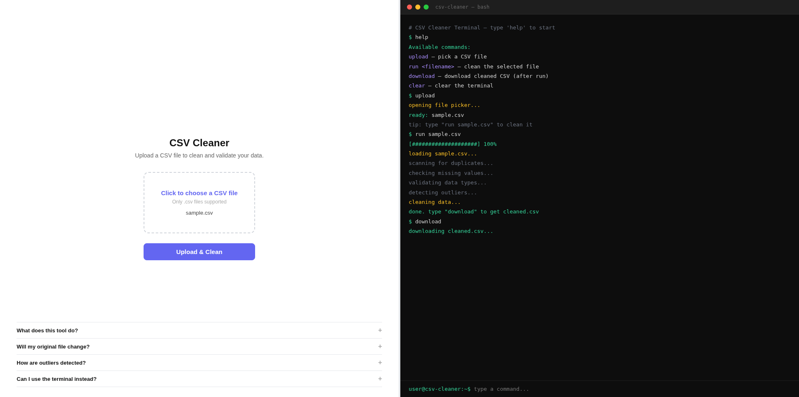
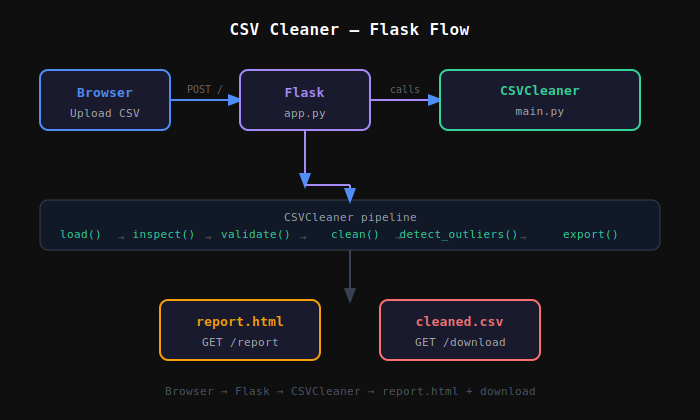

# CSV Data Cleaner and Validator

Build a tool that reads CSV files, identifies inconsistencies (missing values, duplicates, incorrect formats), and automatically cleans the data. Includes data type validation, outlier detection, and export of cleaned datasets. Available as both a CLI tool and a Flask web app.

---

## Project Structure

```
001-main/
├── main.py                  # Core CSV cleaning logic
├── app.py                   # Flask web server
├── sample.csv               # Sample CSV for testing
├── requirements.txt         # Python dependencies
├── templates/
│   ├── index.html           # Main UI page
│   └── report.html          # Report page
├── static/
│   ├── style.css            # Global styles
│   ├── main.js              # JS entry point
│   └── components/
│       ├── divider.js       # Resizable split pane
│       ├── terminal.js      # Interactive terminal (right panel)
│       ├── uploader.js      # Upload form logic (left panel)
│       └── faq.js           # FAQ accordion (bottom left)
└── uploads/                 # Uploaded CSV files (auto-created)
```

---

## Setup

```bash
# Create and activate virtual environment
python -m venv venv
source venv/bin/activate

# Install dependencies
pip install flask pandas numpy
```

---

## CLI Usage

```bash
python main.py              # uses sample.csv by default
python main.py myfile.csv   # pass your own file
```

### CLI Methods

| Method | Description |
|---|---|
| `load()` | Reads the CSV file |
| `inspect()` | Prints shape, types, missing values, duplicates |
| `validate()` | Checks for invalid numeric values and email formats |
| `clean(strategy)` | Removes duplicates, handles missing values (`drop` / `mean` / `median`) |
| `detect_outliers()` | Reports outliers using IQR on numeric columns |
| `remove_outliers()` | Removes outlier rows from the dataset |
| `export(path)` | Saves cleaned data to a CSV file |

---

## Web App Usage

```bash
python app.py
```

Open `http://127.0.0.1:5000` in your browser.

### Routes

| Route | Method | Description |
|---|---|---|
| `/` | GET | Serves the main UI |
| `/` | POST | Receives uploaded CSV, runs cleaning pipeline |
| `/download` | GET | Downloads the cleaned CSV file |

### Web UI (Left Panel)

- Click to pick a CSV file
- Click **Upload & Clean** — runs the full cleaning pipeline via `fetch` (no page reload)
- Button changes to **Download Cleaned CSV** on success
- FAQ pinned at the bottom

### Terminal (Right Panel)

An interactive terminal that mirrors the CLI experience:

```
help      — show available commands
upload    — open file picker
run <filename>  — clean the selected file
download  — download cleaned.csv (only after run)
clear     — clear terminal output
```

### Resizable Split Pane

Drag the divider between the two panels. Each side is limited to a minimum of 25% of the screen width.

---

## Cleaning Pipeline

1. Strip whitespace from column names
2. Remove duplicate rows
3. Handle missing values (drop / fill with mean or median)
4. Auto-convert columns to numeric or datetime where possible
5. Detect outliers using IQR method
6. Remove outlier rows
7. Export cleaned CSV

---

## Outlier Detection (IQR Method)

```
Q1 = 25th percentile
Q3 = 75th percentile
IQR = Q3 - Q1
Outlier if value < Q1 - 1.5 × IQR  or  value > Q3 + 1.5 × IQR
```

---

## Preview

**See:** Fig.1.1.


<p align="center"><em>Fig.1.1: CSV Cleaner — Web UI</em></p>

## Flow

**See:** Fig.1.2.


<p align="center"><em>Fig.1.2: Browser → Flask → CSVCleaner → report.html + download</em></p>
