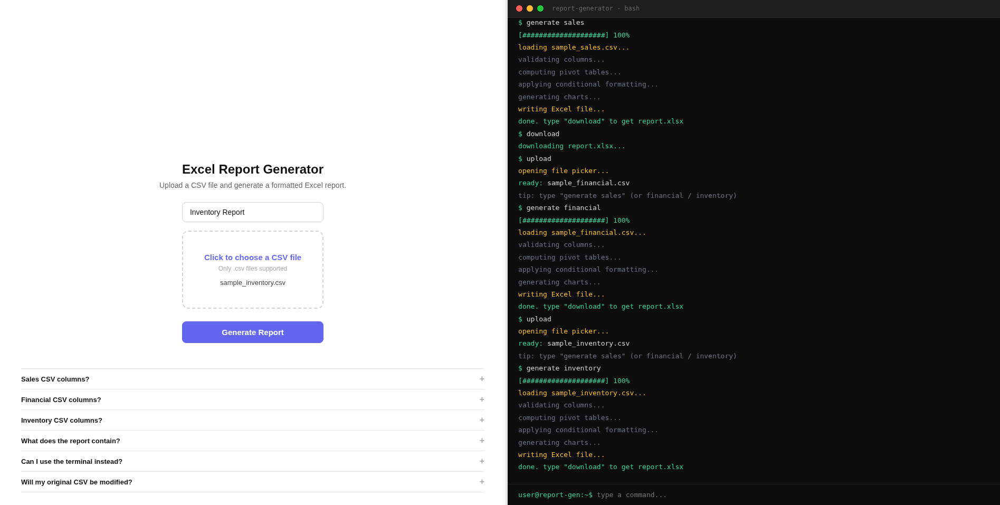
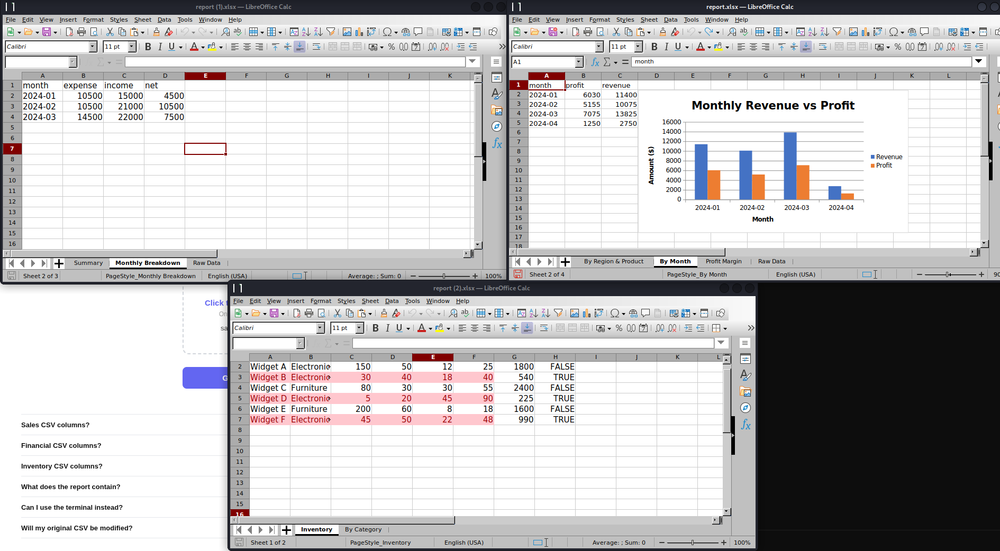
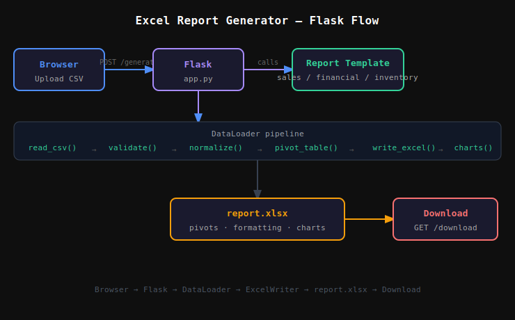

# Excel Report Generator

A web application that takes raw CSV data and generates formatted Excel reports with pivot tables, charts, and conditional formatting. Includes a Flask web UI and a CLI interface.

---

## Project Structure

```
002-main/
├── app.py                         # Flask web server
├── main.py                        # CLI entry point
├── requirements.txt
│
├── data/
│   ├── loader.py                  # CSV loader, validator, normalizer
│   ├── sample_sales.csv           # Sample data for Sales report
│   ├── sample_financial.csv       # Sample data for Financial report
│   └── sample_inventory.csv      # Sample data for Inventory report
│
├── reports/
│   ├── base_report.py             # Abstract base class (load + generate)
│   ├── sales_report.py            # Sales report template
│   ├── financial_report.py        # Financial report template
│   ├── inventory_report.py        # Inventory report template
│   ├── pivot.py                   # Pivot table functions (sales)
│   └── excel_writer.py            # Excel formatting + chart generation (sales)
│
├── static/
│   ├── style.css                  # App styles
│   ├── main.js                    # JS entry point
│   └── components/
│       ├── divider.js             # Draggable split panel
│       ├── uploader.js            # File upload + form handler
│       ├── terminal.js            # Interactive terminal (right panel)
│       └── faq.js                 # FAQ accordion
│
├── templates/
│   └── index.html                 # Main page
│
├── uploads/                       # Temporary uploaded CSV files
└── output/                        # Generated .xlsx reports
```

---

## Setup

### Requirements
- Python 3.13 (system Python — use `/usr/bin/python3` on Kali Linux)
- LibreOffice Calc (to open generated .xlsx files)

### Install

```bash
/usr/bin/python3 -m venv venv
source venv/bin/activate
pip install -r requirements.txt
```

### Dependencies

| Package | Purpose |
|---|---|
| `pandas` | Data manipulation and pivot tables |
| `openpyxl` | Excel engine for reading/writing |
| `xlsxwriter` | Conditional formatting and charts |
| `flask` | Web server and UI backend |

---

## Running the App

### Web UI (Flask)

```bash
python app.py
```

Open `http://127.0.0.1:5000` in your browser.

### CLI

```bash
python main.py <report_type> <input_file> <output_file>
```

Examples:
```bash
python main.py sales     data/sample_sales.csv      output/sales_report.xlsx
python main.py financial data/sample_financial.csv  output/financial_report.xlsx
python main.py inventory data/sample_inventory.csv  output/inventory_report.xlsx
```

---

## Web UI

The interface is a split-panel layout:

- **Left panel** — select report type, upload CSV, click Generate
- **Right panel** — interactive terminal with the same functionality via commands

### Terminal Commands

| Command | Description |
|---|---|
| `help` | List all commands |
| `upload` | Open file picker to select a CSV |
| `generate <type>` | Generate report — type is `sales`, `financial`, or `inventory` |
| `download` | Download the generated report.xlsx |
| `clear` | Clear the terminal |

### Flask API Endpoints

| Method | Route | Description |
|---|---|---|
| `GET` | `/` | Serves the main page |
| `POST` | `/generate` | Accepts `file` + `report_type`, generates xlsx |
| `GET` | `/download` | Downloads the last generated report.xlsx |

---

## Report Types

### Sales Report

**Required CSV columns:**
```
date, region, product, units_sold, unit_price, cost
```

**Computed columns (auto-generated):**
- `revenue` = units_sold × unit_price
- `profit` = revenue − (units_sold × cost)
- `month` = date formatted as YYYY-MM

**Sheets generated:**

| Sheet | Contents |
|---|---|
| By Region & Product | Pivot of revenue — green if > 3000, red if 0 |
| By Month | Monthly revenue & profit with bar chart |
| Profit Margin | Profit margin % per product — orange if < 50% |
| Raw Data | Original data with computed columns |

---

### Financial Report

**Required CSV columns:**
```
date, category, description, amount, type
```

> `type` must be either `income` or `expense`

**Sheets generated:**

| Sheet | Contents |
|---|---|
| Summary | Total income, total expenses, net profit — green if positive, red if negative |
| Monthly Breakdown | Pivot of income vs expense by month with net column |
| Raw Data | Original transactions |

---

### Inventory Report

**Required CSV columns:**
```
product, category, stock, reorder_level, unit_cost, unit_price
```

**Computed columns (auto-generated):**
- `stock_value` = stock × unit_cost
- `needs_reorder` = True if stock ≤ reorder_level

**Sheets generated:**

| Sheet | Contents |
|---|---|
| Inventory | Full inventory — rows at/below reorder level highlighted red |
| By Category | Total items and stock value grouped by category |

---

## Architecture

```
CSV file (user upload or local)
        ↓
  DataLoader (data/loader.py)
  — reads CSV
  — validates required columns
  — computes derived columns
        ↓
  Report Template (reports/*.py)
  — subclass of BaseReport
  — defines load() and generate()
        ↓
  ExcelWriter / xlsxwriter
  — writes sheets
  — applies conditional formatting
  — inserts charts
        ↓
  report.xlsx (output/)
```

### Key design decisions

- **BaseReport (ABC)** enforces `load() → generate()` on every report type, making it easy to add new templates
- **DataLoader** validates at load time — fails fast before any processing begins
- **xlsxwriter** is used as the pandas Excel engine for all reports — better chart and formatting API than openpyxl for write-only workbooks
- **Flask** acts only as a trigger — it receives the file, runs the Python backend, and sends back the xlsx. No data is stored beyond the session

---

## Preview

**See:** Fig.2.1.


<p align="center"><em>Fig.2.1: Excel Report Generator — Web UI</em></p>

**See:** Fig.2.2.


<p align="center"><em>Fig.2.2: Generated Excel report with pivot tables and charts</em></p>

## Flow

**See:** Fig.2.3.


<p align="center"><em>Fig.2.3: Browser → Flask → DataLoader → ExcelWriter → report.xlsx</em></p>

---

## Notes

- On Kali Linux, always use `/usr/bin/python3` to create the venv — the system Python has SSL support required for pip. Thonny's bundled Python does not.
- The `uploads/` folder stores the last uploaded CSV temporarily. It is not cleared automatically.
- Only one report is stored at a time in `output/report.xlsx`. Generating a new report overwrites the previous one.
