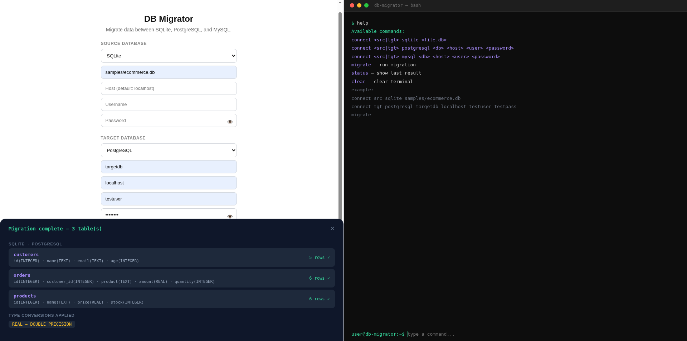
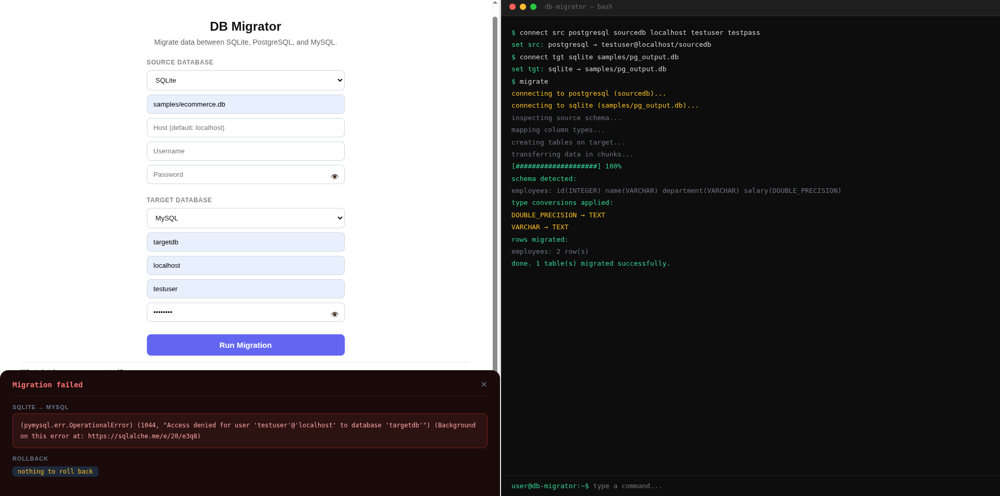
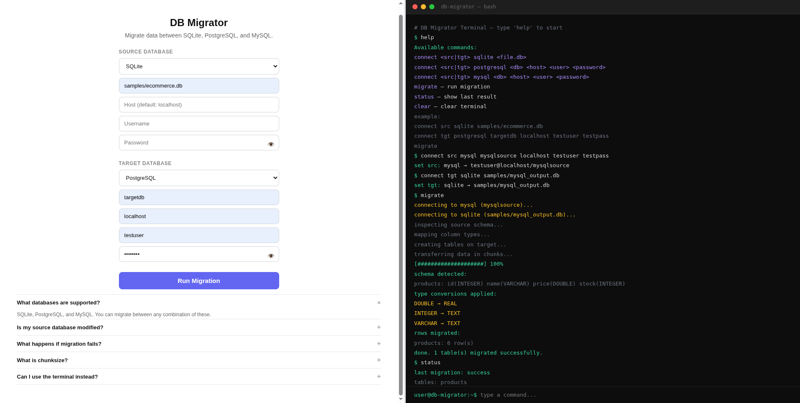
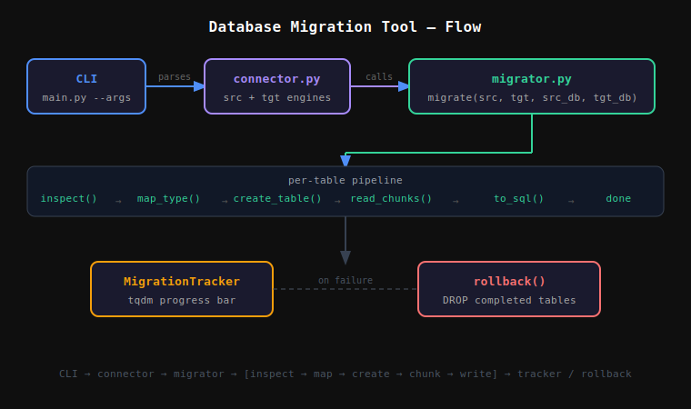

# Database Migration Tool

Migrate data between SQLite, PostgreSQL, and MySQL — with automatic schema inspection, data type conversion, chunked transfers, progress tracking, and rollback on failure. Available as both a CLI tool and a Flask web app with an interactive terminal.

---

## Project Structure

```
003-main/
├── migrator/
│   ├── __init__.py
│   ├── connector.py     # DB connection factory (SQLAlchemy engines)
│   ├── inspector.py     # Reads schema from source DB
│   ├── mapper.py        # Maps column types between DB engines
│   ├── migrator.py      # Core migration logic
│   └── tracker.py       # Progress tracking and rollback
├── samples/
│   ├── ecommerce.db     # Sample: customers, orders, products
│   └── school.db        # Sample: students, teachers, courses
├── templates/
│   └── index.html       # Main UI page
├── static/
│   ├── style.css        # Global styles
│   ├── main.js          # JS entry point
│   └── components/
│       ├── divider.js   # Resizable split pane
│       ├── terminal.js  # Interactive terminal (right panel)
│       ├── form.js      # Migration form logic (left panel)
│       └── faq.js       # FAQ accordion (bottom left)
├── uploads/
│   └── flow.svg         # Architecture flow diagram
├── app.py               # Flask web server
├── main.py              # CLI entry point
└── requirements.txt
```

---

## Setup

```bash
/usr/bin/python3 -m venv venv
source venv/bin/activate
pip install -r requirements.txt
```

### Local database setup (for testing)

**PostgreSQL:**
```bash
sudo systemctl start postgresql
sudo -u postgres psql -c "CREATE USER testuser WITH PASSWORD 'testpass' SUPERUSER;"
sudo -u postgres psql -c "CREATE DATABASE sourcedb OWNER testuser;"
sudo -u postgres psql -c "CREATE DATABASE targetdb OWNER testuser;"
```

**MySQL / MariaDB:**
```bash
sudo systemctl start mariadb
sudo mysql -e "CREATE DATABASE IF NOT EXISTS mysqlsource;"
sudo mysql -e "CREATE USER IF NOT EXISTS 'testuser'@'localhost' IDENTIFIED BY 'testpass';"
sudo mysql -e "GRANT ALL ON mysqlsource.* TO 'testuser'@'localhost';"
```

---

## CLI Usage

```bash
python main.py --src-type <type> --src-database <db> \
               --tgt-type <type> --tgt-database <db>
```

### All CLI arguments

| Argument | Required | Description |
|---|---|---|
| `--src-type` | yes | `sqlite`, `postgresql`, `mysql` |
| `--src-database` | yes | DB name or file path |
| `--src-host` | no | Default: `localhost` |
| `--src-user` | no | Username |
| `--src-password` | no | Password |
| `--src-port` | no | Port (defaults: 5432 / 3306) |
| `--tgt-type` | yes | `sqlite`, `postgresql`, `mysql` |
| `--tgt-database` | yes | DB name or file path |
| `--tgt-host` | no | Default: `localhost` |
| `--tgt-user` | no | Username |
| `--tgt-password` | no | Password |
| `--tgt-port` | no | Port |
| `--chunksize` | no | Rows per chunk (default: `1000`) |

---

## CLI Sample Variations

### SQLite → SQLite
```bash
python main.py \
  --src-type sqlite --src-database samples/ecommerce.db \
  --tgt-type sqlite --tgt-database samples/ecommerce_copy.db
```

### SQLite → PostgreSQL
```bash
python main.py \
  --src-type sqlite --src-database samples/school.db \
  --tgt-type postgresql --tgt-database targetdb \
  --tgt-host localhost --tgt-user testuser --tgt-password testpass
```

### SQLite → MySQL
```bash
python main.py \
  --src-type sqlite --src-database samples/ecommerce.db \
  --tgt-type mysql --tgt-database mysqlsource \
  --tgt-host localhost --tgt-user testuser --tgt-password testpass
```

### PostgreSQL → SQLite
```bash
python main.py \
  --src-type postgresql --src-database sourcedb \
  --src-host localhost --src-user testuser --src-password testpass \
  --tgt-type sqlite --tgt-database samples/pg_output.db
```

### MySQL → SQLite
```bash
python main.py \
  --src-type mysql --src-database mysqlsource \
  --src-host localhost --src-user testuser --src-password testpass \
  --tgt-type sqlite --tgt-database samples/mysql_output.db
```

### MySQL → PostgreSQL
```bash
python main.py \
  --src-type mysql --src-database mysqlsource \
  --src-host localhost --src-user testuser --src-password testpass \
  --tgt-type postgresql --tgt-database targetdb \
  --tgt-host localhost --tgt-user testuser --tgt-password testpass
```

---

## Web App Usage

```bash
python app.py
```

Open `http://127.0.0.1:5000` in your browser.

**See:** Fig.3.0, Fig.3.1, Fig.3.2.


<p align="center"><em>Fig.3.0: Migration complete — SQLite → PostgreSQL, 3 tables migrated, type conversions shown in slide-up panel</em></p>


<p align="center"><em>Fig.3.1: Migration failed — error drawer showing access denied, rollback state, and PostgreSQL → SQLite terminal session</em></p>


<p align="center"><em>Fig.3.2: Full UI — form panel left, interactive terminal right, MySQL → SQLite migration with status command</em></p>

### Routes

| Route | Method | Description |
|---|---|---|
| `/` | GET | Serves the main UI |
| `/migrate` | POST | Accepts JSON config, runs migration, returns JSON result |

### Web UI (Left Panel)

- Select source and target DB types from dropdowns
- Fill in database name, host, user, password
- Click **Run Migration**
- A slide-up dark panel shows results: schema detected, type conversions applied, rows migrated per table
- Password fields have a show/hide eye toggle
- FAQ pinned at the bottom

### Terminal (Right Panel)

An interactive terminal that mirrors the CLI experience in the browser:

```
help                                                        — show available commands
connect <src|tgt> sqlite <file.db>                         — set SQLite DB
connect <src|tgt> postgresql <db> <host> <user> <password> — set PostgreSQL DB
connect <src|tgt> mysql <db> <host> <user> <password>      — set MySQL DB
migrate                                                     — run migration
status                                                      — show last result
clear                                                       — clear terminal
```

### Terminal Sample Variations

**SQLite → SQLite:**
```
connect src sqlite samples/ecommerce.db
connect tgt sqlite samples/ecommerce_copy.db
migrate
```

**SQLite → PostgreSQL:**
```
connect src sqlite samples/school.db
connect tgt postgresql targetdb localhost testuser testpass
migrate
```

**SQLite → MySQL:**
```
connect src sqlite samples/ecommerce.db
connect tgt mysql mysqlsource localhost testuser testpass
migrate
```

**PostgreSQL → SQLite:**
```
connect src postgresql sourcedb localhost testuser testpass
connect tgt sqlite samples/pg_output.db
migrate
```

**MySQL → SQLite:**
```
connect src mysql mysqlsource localhost testuser testpass
connect tgt sqlite samples/mysql_output.db
migrate
```

### Resizable Split Pane

Drag the divider between the two panels. Each side is limited to a minimum of 25% of screen width.

---

## Migration Pipeline

```
1. Connect to source and target databases
2. Inspect source schema — read all tables, columns, types
3. Map each column type to the target DB equivalent
4. Create tables on target with mapped schema
5. Read source data in chunks (default: 1000 rows)
6. Write each chunk to target
7. Track progress per table with a progress bar
8. On failure — rollback all completed tables and exit clean
```

---

## Type Mappings

### SQLite → PostgreSQL / MySQL

| SQLite | PostgreSQL | MySQL |
|---|---|---|
| INTEGER | INTEGER | INT |
| TEXT | TEXT | LONGTEXT |
| REAL | DOUBLE PRECISION | DOUBLE |
| BLOB | BYTEA | LONGBLOB |
| NUMERIC | NUMERIC | DECIMAL |

### MySQL → PostgreSQL / SQLite

| MySQL | PostgreSQL | SQLite |
|---|---|---|
| INT | INTEGER | INTEGER |
| VARCHAR | VARCHAR | TEXT |
| DOUBLE | DOUBLE PRECISION | REAL |
| DATETIME | TIMESTAMP | TEXT |
| LONGBLOB | BYTEA | BLOB |

### PostgreSQL → SQLite / MySQL

| PostgreSQL | SQLite | MySQL |
|---|---|---|
| INTEGER | INTEGER | INT |
| VARCHAR | TEXT | VARCHAR(255) |
| DOUBLE PRECISION | REAL | DOUBLE |
| TIMESTAMP | TEXT | DATETIME |
| BYTEA | BLOB | LONGBLOB |

---

## Rollback Behavior

If migration fails mid-way on any table, all tables already written to the target are automatically dropped — leaving the target database in a clean state with no partial data.

---

## Sample Databases

Located in `samples/`:

**ecommerce.db** — 3 tables
- `customers` — id, name, email, age (5 rows)
- `orders` — id, customer_id, product, amount, quantity (6 rows)
- `products` — id, name, price, stock (6 rows)

**school.db** — 3 tables
- `students` — id, name, grade, score (5 rows)
- `teachers` — id, name, subject, salary (3 rows)
- `courses` — id, title, teacher_id, credits (4 rows)

---

## Flow

**See:** Fig.3.3.


<p align="center"><em>Fig.3.3: CLI / Browser → Flask → migrator package → schema inspect → type map → chunked transfer → tracker / rollback</em></p>

---

## Dependencies

- `pandas` — chunked data transfer
- `sqlalchemy` — DB connections and schema inspection
- `flask` — web interface
- `tqdm` — progress bar
- `pymysql` — MySQL driver
- `psycopg2-binary` — PostgreSQL driver
